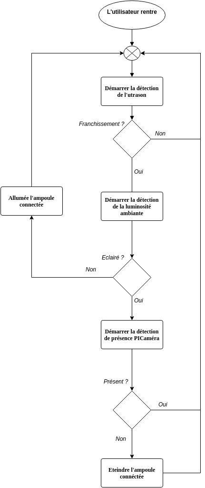

Projet F.A.S
======

*Encombrement des salles et optimisation de parcours*

## Description du projet

Notre projet de FAS est une réponse à l’appel à projet du musée Fabre pour
l’événement "Nuit au musée". Celui-ci accueille près de 3600 étudiants qui
occasionnent des engorgements dans certains salles et rendent difficile la visite des
lieux. C’est pour cela que nous avons décidé de lutter contre l'engorgement des salles
tout en optimisant la visite par le biais d’itinéraires proposés à l’utilisateur en fonction
de l’oeuvre qu’il veut voir.

Pour l’engorgement des salles nous allons compter le nombre total de personne
présente dans chaque salle et le comparer au nombre de personne maximale pouvant
être accueillie.

Le musée/visiteur aura accès à un plan du bâtiment avec le nombre de personne
occupant la salle et un quota sera affiché en fonction de la capacité maximale de
celle-ci.

Pour permettre l’interaction avec le visiteur et qu’il puisse profiter de sa visite au
musée, nous allons créer une application web qui permettra à l’utilisateur d’avoir les
informations en temps réel sur son téléphone.

Cette solution permettra ainsi de faire participer les visiteurs pendant leur visite et
donc de faire passer le musée vers une version 2.0 ce qui le rendra plus attractif que
ses « concurrents ».

## Scénarios

#### Tout se passe bien :
* La caméra fonctionne et donc on arrive à compter exactement le nombre de personne présente dans la salle.
* Le visiteur est bien dirigé vers l'endroit qu'il souhaite dans un temps/distance optimale.

#### Dégradés :
* La caméra marche mais certaines personnes ne sont pas reconnu au passage
ce qui implique que le nombre de personne soit approximative.
* La caméra qui est obstruée par quelqu'un (possibilité de mettre un capteur d’ultrason et un buzzer pour détecter et prévenir ce cas).

* Si la caméra ne marche pas pendant un certain temps on désactive le dispositif
et un envoie une alerte aux responsables (led).

#### Architecture du projet

> Utilisation de la bibliothèque OPENCV pour le traitement de l’image (C / C++ /
Python)

## Dispositif utilisé

* **Raspberry Pi** 2/3

## Choix des capteurs

* **Ultrason** : compris dans le kit Groove
* **Module-caméra** Raspberry Pi® Raspberry Pi® Camera V2 8MP

## Auteurs

Kévin Hassan - Godefroi Roussel - 2016 :copyright:
